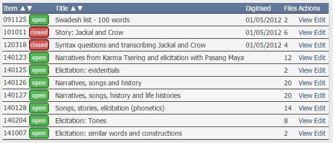

# Getting Started with PARADISEC

  

This page is dedicated to helping you begin the seemingly overwhelming process of getting your materials organised and eventually archived with [PARADISEC (Pacific and Regional Archive for Digital Sources in Engangered Cultures)](https://www.paradisec.org.au/).

## STEP 1: Sign up as a user with PARADISEC
Signing up with PARADISEC means you become a PARADISEC user. As a user you can access data in an open collections after agreeing to PARADISEC’s conditions of access, or you may send a request to access data that has restrictions on viewing by following instructions provided by the collector on their catalog page.

You also need to sign up with PARADISEC if you wish to deposit material to the archive. 

  

The process of signing up is simple- go to the PARASDISEC catalog web page: [http://catalog.paradisec.org.au/](http://catalog.paradisec.org.au/), and click on **Sign up** in the upper right‐hand corner. Once you sign up, you get an automated message informing you to check your email to confirm your account, 
>*"A message with a confirmation link has been sent to your email address. Please open the link to activate your account"*

Click on the link in your email to confirm. 

Congratulations, you are now a PARADISEC user! It is recommended that you browse the collections held in PARADISEC so that you can investigate the different ways collections can be organised. Below are a some examples:
* ***PhD thesis:*** [OE1](https://dx.doi.org/10.4225/72/58949afab6af0) is a collection of narratives and wordlists that the depositor used in writing their PhD thesis. This includes the segmented audio files that are linked to the exemplar utterances within the thesis.
* ***Field methods course:*** The [MEU1](https://dx.doi.org/10.26278/5e00d67b8be35) collection holds all recordings generated during a field methods course. Note how the different type of events (classroom recordings vs breakout sessions) are kept together by the nature of the item names.
* ***Separate collections for each language/dialect/variety:*** Explore two of this depositor's 27 collections, [SDM42](https://catalog.paradisec.org.au/collections/SDM42) and [SDM45](http://catalog.paradisec.org.au/collections/SDM45). Each of these collections feature one language variety. There is no limit as to how many collections you can create.
* ***Many languages in one collection:*** In the [DD1](https://dx.doi.org/10.4225/72/56E8248563EE0) collection, the depositor has included recordings of over 25 languages, collected since 2010. This collection is still growing! 

## STEP 2: Contact PARADISEC to help you create a new collection

Only PARADISEC administrators can create a collection in the catalog.  When you are ready for us to create a collection, contact the PARADISEC administration at [admin@paradisec.org.au](admin@paradisec.org.au) or the [CoEDL Data Manager](mailto:julia.miller@anu.edu.au). To begin with you will need to provide us with the following information:

* Collection ID
* A brief title of your collection
* A more detailed description of your collection
* Funding body (if applicable) (e.g. ARC, ELDP, etc.)
   * Grant identifier (if applicable) (e.g. CoEDL = CE140100041 or Wellsprings = FL130100111)

### Preliminary exploration of your files

Before you contact PARADISEC, take a look at your files and determine how you want your collection(s) presented. Do you need one collection? Or more than one? This is the time for you to reflect upon how you want your material organised in the archive.

### Information to provide to PARADISEC

Once you have decided upon which files you would like to archive, come up with a name and description for your collection. As for the Collection ID, PARADISEC administrators can help you come up with this- the collection ID should be a unique identifier (could be your initials in all caps and a digit, or the ISO language code).

*Example collection IDs: **JM1, JCM4, OE1, MEU1, etc.**
The digit is required and it distinguishes your collection from that of someone with the same initials (John Mansfield, Julia Miller, etc), but also allows for multiple collections, should you require, e.g. **JM1, JM2... JM85***.

## STEP 3: Organise materials to be sent to collection

### PARADISEC's metadata spreadsheet

PARADISEC has created a spreadsheet that allows us to automatically create the catalog metadata for items in your collection. You can acces the spreadsheet [here](http://www.paradisec.org.au/wp-content/uploads/2020/10/PDSCMinimalMetadata2020.xlsx). If the .xlsx file does not download automatically, then right-click on the link to save the file. Please do not alter the structure of the spreadsheet, as this will prevent the auto-upload process for us.

Once your collection has been created, and has been populated with the metadata for your items, you can edit you collection information directly via the catalog pages. You can add details such as:

* your institutional affiliation
* alternate names of the language(s)
* you can set the map by zooming in on the map feature and selecting an area, or set it automatically by selecting the country or language

  

* you can define/change access conditions

  

* you can even assign editor privileges to a colleague or research assistant to help you update the collection's metadata

### PARADISEC's file naming conventions

Now comes the thrilling task of making sure your files are names appropriately. Getting your file names in order should come *after* you have created your collection and *after* you have settled on the organisation of your items (recording sessions) within your collection. 

**ANATOMY OF A PARADISEC FILE NAME**
Say you have, for example, a file that you named 20150908‐wordlist‐01.wav while in the field. This in‐field naming convention includes the date in ISO format (YYYYMMDD). The (‐wordlist) marks this as being from a session involving wordlist elicitation. The (‐01) indicates that this is the first track of the session. You will have your own conventions. 

The name 20150908‐wordlist‐01.wav does not fit with the PARADISEC naming conventions. First of all, there needs to be a collection ID followed by a hyphen, and then only two more parts separated by hyphens: CollectionIDItemID‐ContentFile.

1. **CollectionID** is your PARADISEC collection name and it typically has the shape of your initials in capital letters and a number. This ID can be determined by you, but must be confirmed as available for use by the CoEDL Data Manager or a PARADISEC administrator. This ID is created when you set up a collection in  PARADISEC. Mine could be JCM1

2. **ItemID** is also made up of alpha‐numeric characters. You may use an underscore ( _ )if you need a separator; hyphens ( ‐ ) are reserved PARADISEC operators,  so cannot be used within a file name, excepting the two that separate the three parts of the file name. This ItemID can be used to differentiate recording sessions or events. You may have speaker initials in your item name (JB), abbreviation of the task (WRDLST), field site (BIMA).
3. **ContentFile** is also made up of alpha‐numeric characters. This part of the name allows you to enumerate files of the same format, i.e. photos with 001, 002, etc, or multiple tracks of a single audio or video session. If you want to retain some of the original name, try something like this: **JCM01‐20150908_WORDLIST‐01.wav**

  

### PARADISEC's deposit form

And lastly, you need to fill out a [deposit form](http://www.paradisec.org.au/PDSCdeposit.pdf) that provides PARADISEC with your contact information, access conditions for your collection, including any restrictions. Fill in the form, sign it, scan or photograph it, and email it back to us. We keep this digital record with your collection.

## STEP 4: Sending your files to PARADISEC

If you are planing to archive digital files with PARADISEC, and your institution is part of the Australian Access Federation (AAF), you can sign up for a [Cloudstor](https://cloudstor.aarnet.edu.au/) account. Once you do, you get 1TB of free storage available to you instantly. You can also send us OneDrive, Dropbox, Google Drive links. These options are the best means to transfer files to PARADISEC. If you do not use any of those cloud storage options, but would like to transfer your files this way, contact [PARADISEC](mailto:admin@paradisec.au.org) or the [CoEDL Data Manager](mailto:julia.miller@anu.edu.au) and we can create a Cloudstor folder for you to use for transferring files to us.

If uploading files to a cloud service is not possible due to a lack of computer access or poor internet connections, you can post a hard drive of your materials to PARADISEC at:

PARADISEC  
Room 3019, Sydney Conservatorium of Music C41  
The University of Sydney  
NSW 2006 AUSTRALIA  

Or to the CoEDL Data Manager at:

ATTN: CoEDL Data Manager  
The ARC Centre of Excellence for the Dynamics of Language  
College of Asia Pacific  
The Australian National University  
Coombs Building, 9 Fellows Road  
Acton 2601 ACT AUSTRALIA  

